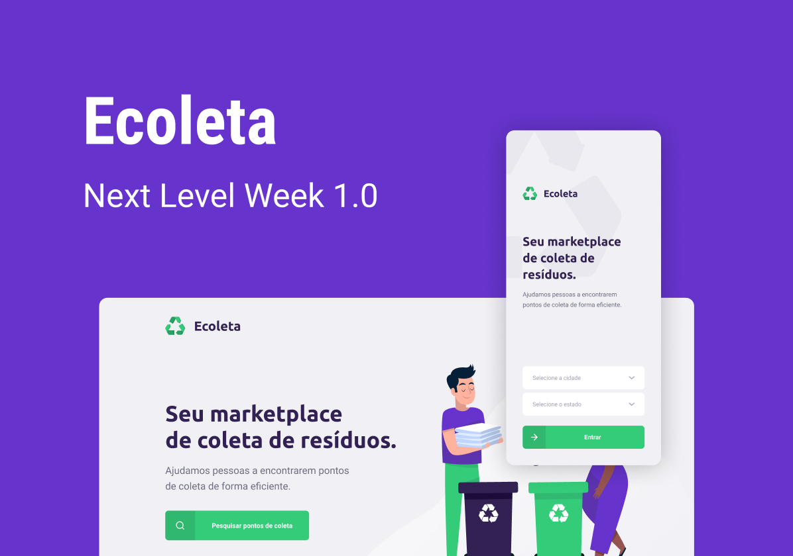

# :recycle: Ecoleta
The **Ecoleta** is an application that helps people find the nearst collection points.

This project was developed during the **Next Level Week 1.0** by **[Rocketseat :rocket:](https://github.com/Rocketseat)**.

# :hammer: Dependencies
- [react](https://reactjs.org/)
- [typescript](https://www.npmjs.com/package/typescript)
- [axios](https://www.npmjs.com/package/axios)
- [react-native](https://reactnative.dev/)
- [react-native-maps](https://www.npmjs.com/package/react-native-maps)
- [react-native-svg](https://www.npmjs.com/package/react-native-svg)
- [expo](https://expo.io/)
- [expo-font](https://www.npmjs.com/package/expo-font)
- [expo-location](https://www.npmjs.com/package/expo-location)
- [expo-mail-composer](https://www.npmjs.com/package/expo-mail-composer)

# :checkered_flag: Getting started
Just run `npm start` :slightly_smiling_face:.

# :memo: License
- [MIT license](https://opensource.org/licenses/MIT)